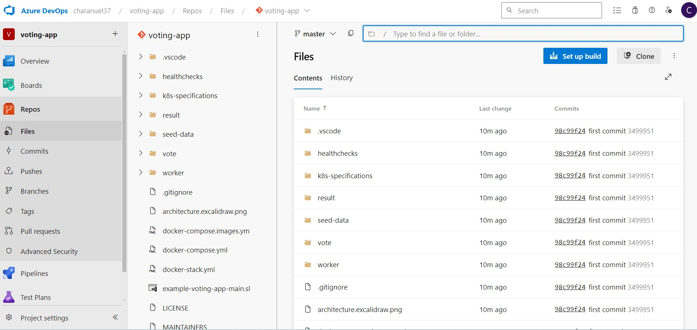
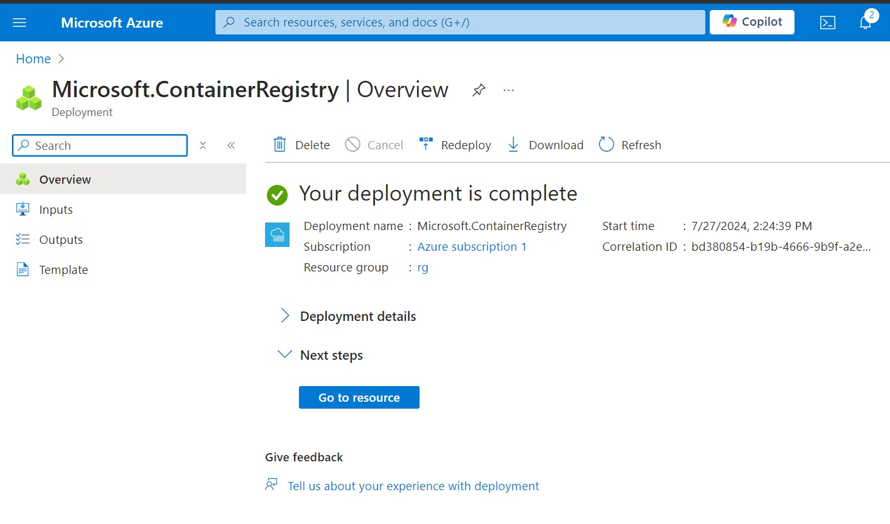

## Welcome to the eCommerce-website--azure-project-by-docker-

# Aim   
## of the project is to Host eCommerce-website created by docker by using Azure services(AKS)

This can be useful to the peoples who what to know more about how a website can be publish through azure services and how to create CI/CD pipelines through azure DevOps (to make deployment process smooth and easy) This repo is updates regularly

In 1st phase I am going to deploy a website which is developed by docker team by using  
. Cloud Azure Services  
. Azure DevOps CI   
. Argocd - CD   
. Azure Kubernetes Services - Hosting website  

In this phase we try to host website in easier way later on we add add some extra services or tools  

# Phase-1

Let's Get Start  
#Step:1  
##Forking git repo from docker to local then pushing it to our git repo  

https://github.com/dockersamples/example-voting-app - This is the link to open-project that is created by Docker  

One thing to know when you are forking, If you are forking into your repo from othere then there would be no issue. But if you are forking (downloading) to your local pc then want to push to your remote repo then fallow this steps to avoid confusion  
click on link => code => select download ZIP => extract file => there you find file in the file "move the main file form it and make it separate file " => work on that file  

** Remove .gitfile from voting-app file **  

Now use git command to push you local repo to remote repo in this case I will push my code to Azure devops repo  

In this step I used these git commands  

git inti  
git add .  
git commit -m "first commit"  
git remote add origin "URL of the azure repo"  
git push --set-upstream origin master after these steps I pushed all my voting-app code to azure repo  
This how it look like  

  
## Now we are going to Create Continuous Integration(CI)

Now we need to create a pipeline for each module, where in this project we have 3(voting, result, work) and also these are written in different languages

for this project we store the built image in ACR (Azure Container Registry) for that fist we create ACR  
Steps:  
 Create Resource group and select >> Registry name (shod be unic) >> Location >> Pricing plan (in this standard used) >> if you want give tag >> click on review and create

After this go to Azure devOps website and create a Ymal pipeline for any module click on pipelines >> then select create new pipeline >> select repo >> build and push image >> connect to azure where you created ACR (by confirming e-mail) >> then you get a build and push code

Just run it don't update any thing for now you can push the code in ACR by running it there are the steps

  

These the built image file that sent to the ACR after built by running azure pipeline
